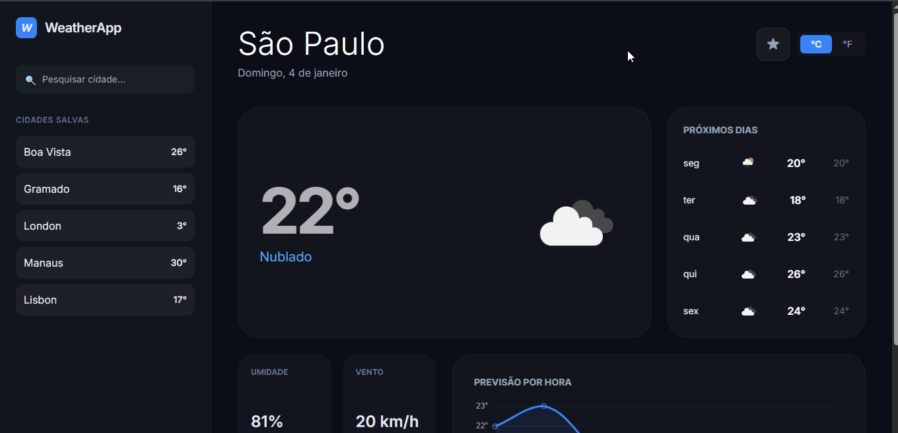

# 🌤️ WeatherApp


WeatherApp é uma aplicação de previsão meteorológica que oferece informações detalhadas sobre o clima em tempo real. Desenvolvida com foco em experiência do usuário, apresenta uma interface moderna com tema escuro, gráficos interativos e sistema de favoritos. O projeto utiliza a API do OpenWeatherMap para fornecer dados precisos e atualizados sobre temperatura, umidade, vento e previsão estendida.

---
## 📸 Demonstração


---
## ✨ Funcionalidades
- 🔍 **Busca de Cidades** - Pesquise o clima de qualquer cidade do mundo
- 📍 **Geolocalização** - Use sua localização atual para ver o clima local
- ⭐ **Sistema de Favoritos** - Salve suas cidades preferidas para acesso rápido
- 🌡️ **Toggle Celsius/Fahrenheit** - Alterne entre unidades de temperatura
- 📊 **Gráfico Interativo** - Visualize a previsão de temperatura das próximas 24 horas
- 📅 **Previsão de 5 Dias** - Confira a previsão estendida com temperaturas máximas e mínimas
- 💨 **Métricas Detalhadas** - Informações sobre umidade, vento, pressão e sensação térmica
- 🌙 **Interface Moderna** - Design elegante com tema escuro e animações suaves
- 💾 **Persistência Local** - Seus favoritos são salvos no navegador

---
## 🛠️ Tecnologias Utilizadas
### Front-end
- **HTML5** - Estrutura semântica da aplicação
- **TailwindCSS** - Framework CSS utilitário para design responsivo
- **JavaScript (ES6+)** - Lógica da aplicação com módulos ES6

### Bibliotecas
- **[Chart.js](https://www.chartjs.org/)** - Gráficos interativos de temperatura
- **[OpenWeatherMap API](https://openweathermap.org/api)** - Dados meteorológicos em tempo real

### APIs do Navegador
- **Geolocation API** - Obtenção da localização do usuário
- **LocalStorage API** - Persistência de favoritos
- **Fetch API** - Requisições HTTP assíncronas

---
## 🚀 Como Usar
Você pode acessar a versão online aqui:
[Demonstração Online](https://weather-app-amber-ten-13.vercel.app/) 
Ou, se preferir rodar localmente em sua máquina:

### Pré-requisitos
- Navegador web moderno
- Conexão com a internet

### Instalação
1. **Clone o repositório**

```bash
   git clone https://github.com/devrodrigobrito/weather-app.git
```

2. **Navegue até a pasta do projeto:**

```bash
cd weather-app
```

3. Abra o arquivo `index.html` no seu navegador:
```bash
# No Windows
start index.html

# No Mac
open index.html

# No Linux
xdg-open index.html
```

Ou simplesmente arraste o arquivo `index.html` para o navegador.
> **Nota:** Não é necessário instalar dependências, pois o projeto utiliza CDN do Tailwind CSS.

---
## 📚 Aprendizados
Durante o desenvolvimento deste projeto, foram aplicados e consolidados os seguintes conceitos:

### JavaScript Moderno
- ✅ Módulos ES6 (import/export)
- ✅ Async/await e Promises
- ✅ Destructuring e spread operator
- ✅ Arrow functions e template literals
- ✅ Manipulação de arrays (map, filter, forEach)

### Arquitetura de Código
- ✅ Separação de responsabilidades (modularização)
- ✅ Padrão de organização de arquivos
- ✅ Reutilização de código
- ✅ Tratamento robusto de erros

### APIs e Integrações
- ✅ Consumo de APIs REST
- ✅ Tratamento de requisições assíncronas
- ✅ Geolocalização do navegador
- ✅ LocalStorage para persistência de dados

### UI/UX
- ✅ Design responsivo com TailwindCSS
- ✅ Visualização de dados com Chart.js
- ✅ Feedback visual ao usuário
- ✅ Estados de loading e erro

### Boas Práticas
- ✅ Versionamento com Git
- ✅ Documentação clara
- ✅ Código limpo e legível

---
## 👨‍💻 Autor
**Rodrigo Brito**
- GitHub: [@devrodrigobrito](https://github.com/devrodrigobrito)
- LinkedIn: [devrodrigobrito](www.linkedin.com/in/devrodrigobrito)
- E-mail: rodrigobritocontato@gmail.com


